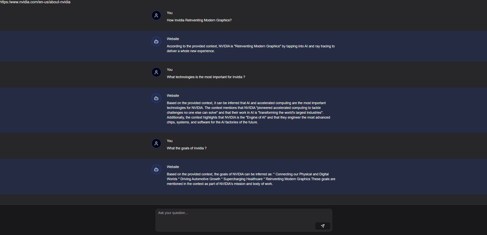

# **WebTalk: Chat with Your Website**

<div align="center">
    
</div>

A dynamic chat application built with **Next.js**, integrating **RAG (Retrieval-Augmented Generation)** using Upstash and Redis for efficient data handling and state management. WebTalk allows users to interact with a chat interface powered by AI, generating intelligent responses based on the content of your website.

---

## **Table of Contents**

- [Features](#features)
- [Tech Stack](#tech-stack)
- [Prerequisites](#prerequisites)
- [Installation](#installation)
- [Environment Variables](#environment-variables)
- [Running the Application](#running-the-application)
- [Project Structure](#project-structure)
- [License](#license)

---

## **Features**

- **Intelligent Chat Interface**: Engage in conversations powered by AI, capable of generating contextually relevant responses.
- **Session Management**: Seamless user sessions using cookies for a continuous chat experience.
- **Content Indexing**: Automatically indexes website content for precise and relevant answers.
- **Real-time Messaging**: Supports real-time interactions through streaming technology.
- **Customizable UI**: Built with **NextUI** and **Tailwind CSS** for a modern and responsive interface.

---

## **Tech Stack**

- **[Next.js](https://nextjs.org/)**: React framework for server-rendered applications.
- **[TypeScript](https://www.typescriptlang.org/)**: Strongly typed programming language.
- **[Upstash Redis](https://upstash.com/)**: Managed Redis service for scalable state management.
- **[RAG Chat](https://github.com/upstash/rag-chat)**: Retrieval-Augmented Generation for enhanced conversational AI.
- **[NextUI](https://nextui.org/)**: Modern UI library for React.
- **[Tailwind CSS](https://tailwindcss.com/)**: Utility-first CSS framework.
- **[Lucide](https://lucide.dev/)**: Icon library.

---

## **Prerequisites**

- [Node.js](https://nodejs.org/en/) v16 or later
- Upstash account with Redis and Vector databases set up

---

## **Installation**

1. **Clone the Repository**:
   ```bash
   git clone https://github.com/your-username/webtalk.git
   cd webtalk
   ```

2. **Install Dependencies**:
   Using npm:
   ```bash
   npm install
   ```

3. **Set Up Environment Variables**:
   Create a `.env` file in the root directory and add the following variables:
   ```bash
   UPSTASH_VECTOR_REST_URL="https://your-vector-url.upstash.io"
   UPSTASH_VECTOR_REST_TOKEN="your-upstash-vector-token"
   QSTASH_TOKEN="your-qstash-token"
   UPSTASH_REDIS_REST_URL="https://your-redis-url.upstash.io"
   UPSTASH_REDIS_REST_TOKEN="your-upstash-redis-token"
   ```

   Replace the placeholder values with your Upstash credentials.

---

## **Environment Variables**

| Variable                   | Description                                    |
|----------------------------|------------------------------------------------|
| `UPSTASH_VECTOR_REST_URL`   | Upstash Vector Database REST URL               |
| `UPSTASH_VECTOR_REST_TOKEN` | Upstash Vector Database REST Token             |
| `QSTASH_TOKEN`              | QStash Token for message queuing               |
| `UPSTASH_REDIS_REST_URL`    | Upstash Redis Database REST URL                |
| `UPSTASH_REDIS_REST_TOKEN`  | Upstash Redis Database REST Token              |

Ensure that all tokens and URLs are kept secure and not exposed publicly.

---

## **Running the Application**

1. **Development Mode**:
   Start the development server:
   ```bash
   npm run dev
   ```
   ```
   Open [http://localhost:3000](http://localhost:3000) to view the application.

2. **Production Build**:
   Build the application for production:
   ```bash
   npm run build
   npm start
   ```

---

## **Project Structure**
```
├── src/
│   ├── app/
│   │   ├── [...url]/
│   │   │   └── page.tsx
│   │   ├── api/
│   │   │   └── chat-stream/
│   │   │       └── route.ts
│   │   ├── layout.tsx
│   │   └── page.tsx
│   ├── components/
│   │   ├── Chat.tsx
│   │   ├── ChatInput.tsx
│   │   ├── Message.tsx
│   │   ├── Messages.tsx
│   │   └── Providers.tsx
│   ├── lib/
│   │   ├── rag-chat.ts
│   │   ├── redis.ts
│   │   └── utils.ts
│   ├── middleware.ts
│   └── globals.css
├── public/
│   └── fonts/
│       ├── GeistVF.woff
│       └── GeistMonoVF.woff
├── .env
├── package.json
├── tsconfig.json
└── README.md
```

---

## **License**

This project is licensed under the MIT License. See the [LICENSE](LICENSE) file for more details.

---
